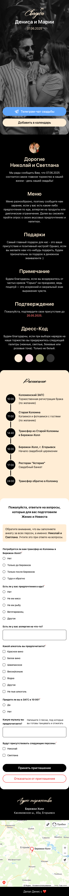

### Сайт-визитка для моей свадьбы

Можете использовать этот шаблон для создания сайта-визитки для своей свадьбы. 
Вы можете настроить его под свои нужды. Вам всего лишь нужно изменить текст и изображения, некоторые ссылки.

Сайт включает в себя:
- Персонализация для каждого гостя или группы гостей.
- Опрос для гостей, который можно настроить под свои нужды.
- Возможность скачать файл для гугл-календаря с датой и временем свадьбы.
- Ссылку на телеграм-канал для гостей, где можно будет обсуждать свадьбу и задавать вопросы.

Также имеется админ-панель для управления гостями и их персонализированными ссылками для приглашения и прохождения опроса.

### Используемые технологии
- Laravel 11
- PHP 8.2
- Filament
- MySQL
- Livewire
- Tailwind CSS
- Alpine.js
- Laravel Forge (для деплоя и управления сервером)

### Установка
1. Клонируйте репозиторий:
2. Разверните проект на локальном сервере или хостинге.
3. Настройте базу данных и выполните миграции:
4. Сидером можно добавить тестового юзера для управления админкой по адресу /admin:

Внутри репозитория есть файл docker-compose.yml, который позволяет развернуть проект в контейнерах Docker локально

### Как это выглядит:

Сайт рассчитан на мобильные устройства, но также адаптирован для десктопов в узком формате.

